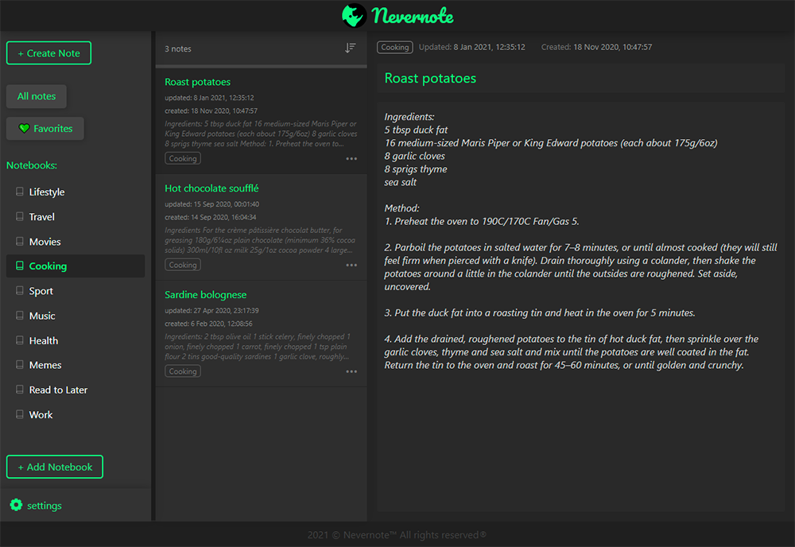

<p align='center' markdown="1">
  
</p>
<br>
<h2 align='center'>Application for text notes</h2>
<br>
<p align="center">
  
</p>

<br>

## Installation

install
```bash
npm i
```
or
```bash
yarn
```

### Run server
```bash
npm run db
```
or
```bash
yarn db
```
### Run client
start client in another terminal 
```bash
npm run start
```
or
```bash
yarn start
```